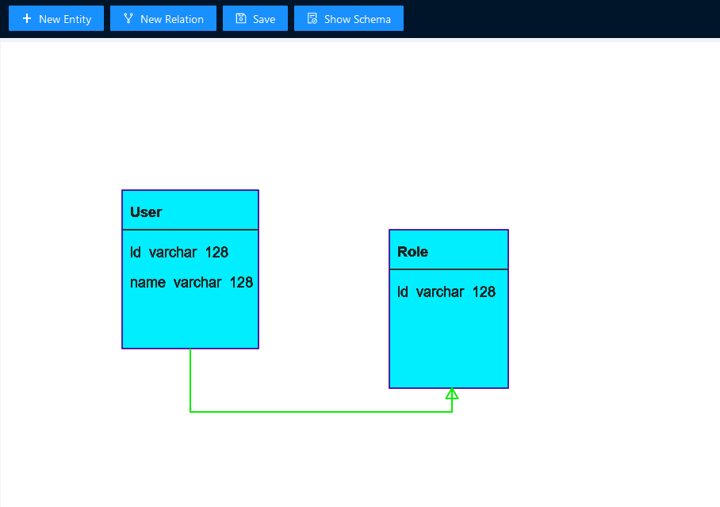
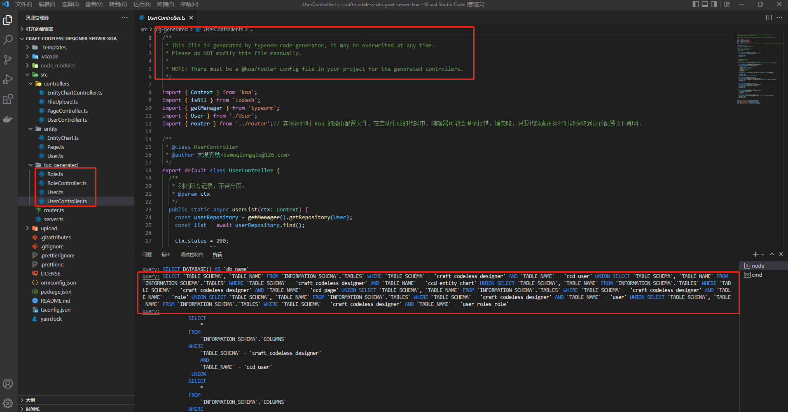
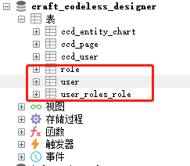

<h1 align="center">IED: ice entity designer</h1>

## 1.简介

IED 是基于 [!ice-render内核](https://github.com/ice-render/ice-render) 构建的一款图形化的 Entity-Relation 设计工具。

IED 将会生成符合 typeorm 框架定义的 Shema 格式，然后可以自动生成实体类代码和 CRUD 代码。

完整的使用案例请参见此项目：https://github.com/craft-codeless-designer/craft-codeless-designer-server-koa

## 2.屏幕截图

## 3.License

[MIT licensed](./LICENSE).