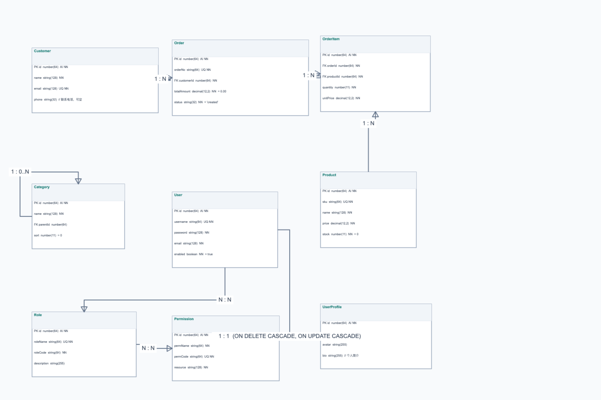
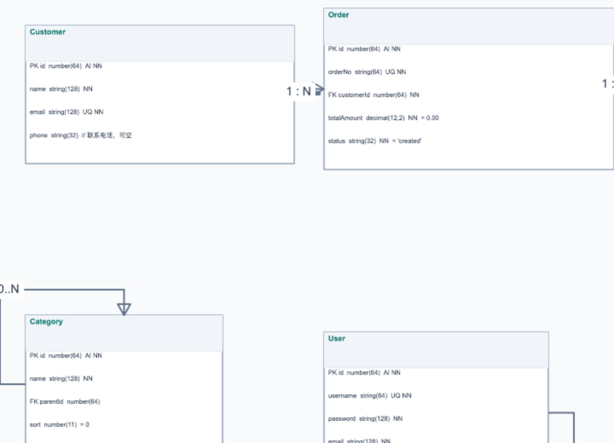
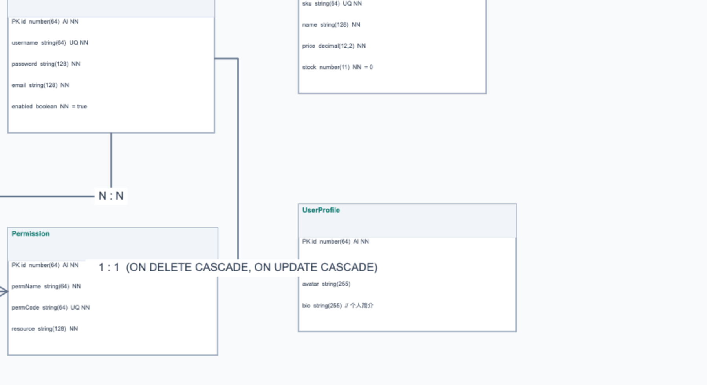

<p align="center">
  
</p>

<h1 align="center">IED: ice entity designer</h1>

## 1. 简介

IED 是基于 [ice-render](https://github.com/ice-render/ice-render) 构建的图形化 Entity-Relation 设计工具。

它可以把实体、字段和关系组织成清晰的 ER 图，并导出符合 TypeORM 规范的 Schema 描述，方便后续生成实体类代码和 CRUD 代码。

完整使用案例请参见：

- <https://github.com/craft-codeless-designer/craft-codeless-designer-server-koa>

## 2. 功能特性

- 可视化编辑实体：实体名、字段类型、长度、默认值、注释
- 常用约束标记：`PK` / `FK` / `UQ` / `AI` / `NN`
- 支持四种关系：`one-to-one` / `one-to-many` / `many-to-one` / `many-to-many`
- 支持自引用关系，并可指定 `parent` / `children` 属性名
- 支持 `onDelete` / `onUpdate` / `joinTableName`
- 实体表头、字段文本、分隔线样式可配置
- 画布支持滚轮缩放和空白处拖拽平移
- 支持拖拽对齐辅助线和磁吸效果
- 支持实时属性编辑、Undo / Redo
- 支持 Schema 基础校验
- 支持项目级保存 / 加载
- 提供 TypeORM Schema 序列化输出

## 3. 屏幕截图

完整关系图：



实体字段与约束展示：



多对多、自引用与关系语义：



## 4. 快速开始

```bash
npm install
npm run build
```

在浏览器中打开示例页面：

- `tests/entity-basic.html`：基础实体和一对多关系
- `tests/entity-relations.html`：覆盖四种关系、自引用、多对多连接表和多种约束
- `tests/entity-editor.html`：可实时编辑实体字段、创建/删除实体和关系

## 5. 生成 Schema

```js
const schema = IED.toSchemaObject(ice.childNodes);
const schemaText = IED.toSchemaString(ice.childNodes);
```

## 6. License

[MIT licensed](./LICENSE).
