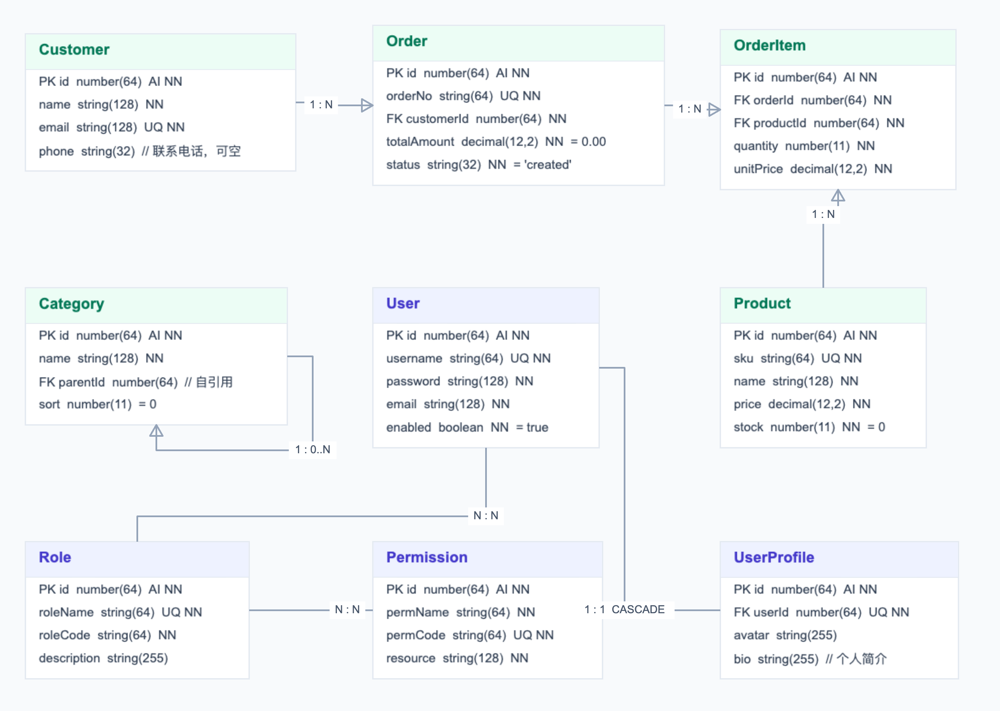
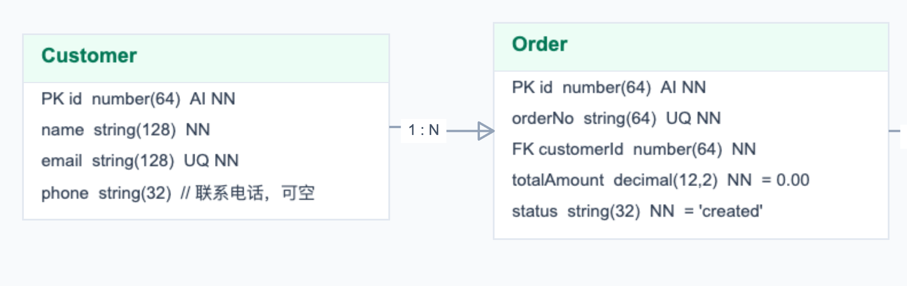
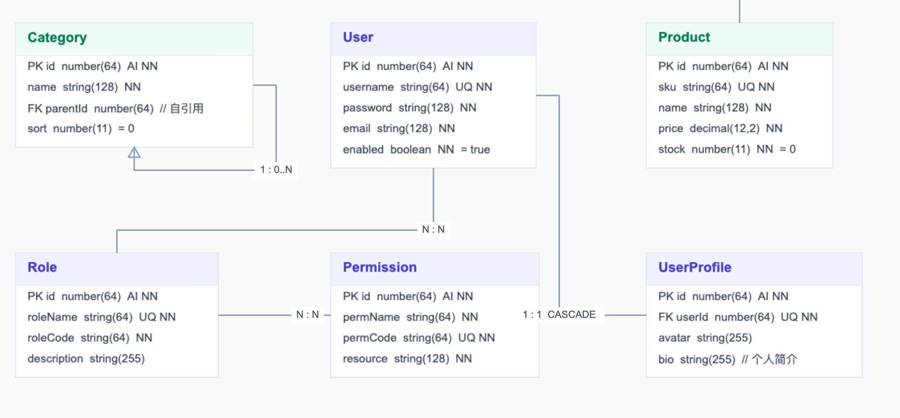
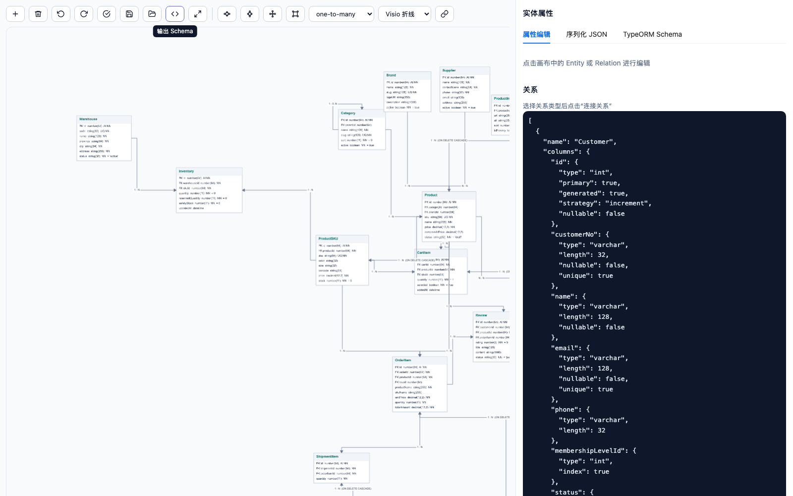
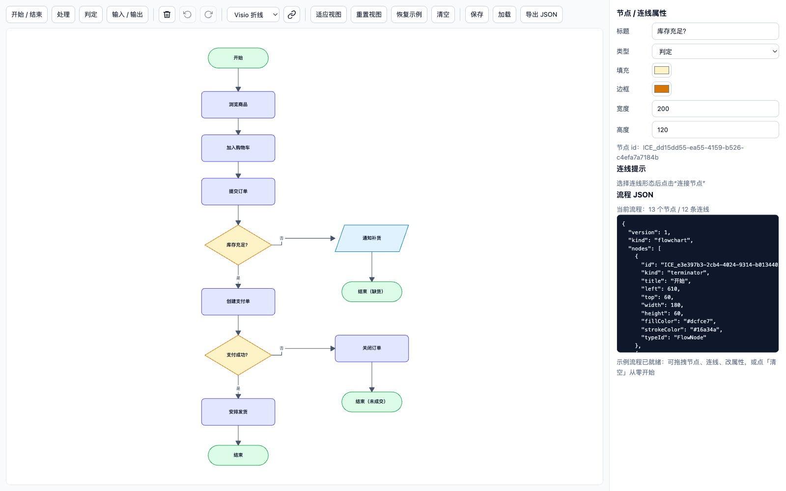
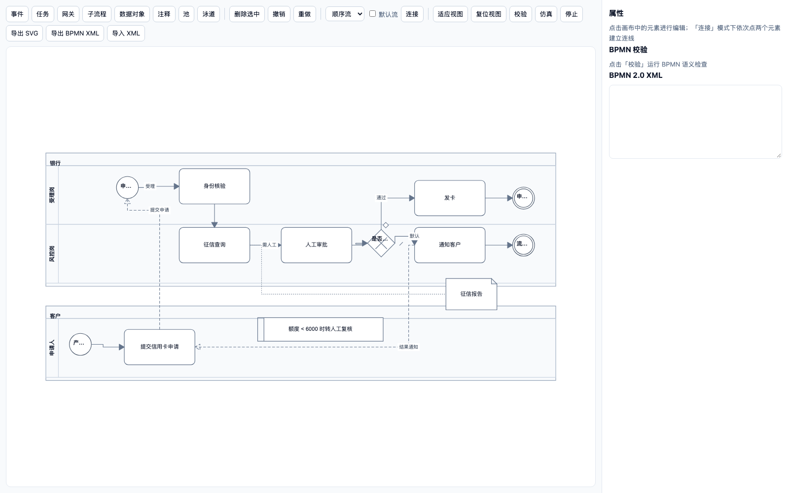

<p align="center">
  
</p>

<h1 align="center">IED · ice entity designer</h1>

<p align="center">基于 ice-render 的可视化 ER 建模工具：拖拽建图，一键导出 TypeORM Schema。</p>

<p align="center">
  <a href="./LICENSE"></a>
  
  
  
</p>

## 1. 项目定位

IED（ice entity designer）是基于 [ice-render](https://github.com/ice-render/ice-render) 构建的**可视化 Entity-Relation 建模工具**。它以「节点 = 实体，连线 = 关系」组织数据模型，把画布上的设计结果序列化为符合 TypeORM `EntitySchema` 规范的 Schema，从而将「结构设计」与「实体类 / CRUD 代码生成」直接衔接。

它不重复实现底层图元，而是在 ice-render 的通用图编辑内核之上，收敛出 ER 建模最常用的交互闭环：选择、创建、更新、删除、关系连接、校验与 Schema 输出。

> **引擎内核已打包进本包**：安装 `ice-entity-designer` 即可直接使用，无需再安装 `ice-render`——内核在构建时被打进产物并从本包一并导出（含完整类型声明），保证 `ICE` 实例与 `Entity` / `Relation` 组件来自同一份内核。

完整使用案例请参见：

- <https://github.com/craft-codeless-designer/craft-codeless-designer-server-koa>

## 2. 核心能力

### 可视化建模

- 拖拽编辑实体：实体名、字段类型、长度、默认值、注释。
- 字段级约束标记：`PK` / `FK` / `UQ` / `AI` / `NN`，并支持 `index`。
- 实体表头、字段文本、分隔线样式均可配置（`headerStyle` / `fieldStyle` / `dividerStyle`）。

### 关系表达

- 覆盖四种关系：`one-to-one` / `one-to-many` / `many-to-one` / `many-to-many`。
- **连线形态可切换**：`linkShape: 'visio' | 'bezier'`（默认 `visio`）。Visio 是引擎的正交折线（出口点 + 路径评分），
  贝塞尔是沿插槽法线出/入的三次曲线。编辑器里改连线形态有两个入口：选中连线后用**关系属性面板**的「连线形态」下拉，
  或用**工具栏**的同名下拉 —— 选中连线时它直接改这条线，未选中时它同时作为新建连线的默认形态。
- 支持自引用关系，并可指定 `parent` / `children` 属性名。
- 关系语义完整：`onDelete` / `onUpdate` / `joinTableName`，以及自定义两端基数（如 `1 : 0..N`）。
- 连线标签自动呈现基数与约束（如 `1 : 1  ON DELETE CASCADE`）。

### 导出与校验

- **一键导出 TypeORM Schema**：`toSchemaObject()` / `toSchemaString()` 输出符合 TypeORM `EntitySchema` 规范的普通对象，可直接 `new EntitySchema(obj)` 使用。
- **关系外键归属自动判定**：`one-to-many` / `one-to-one` 的外键在目标侧、`many-to-one` 的外键在源侧，`joinColumn` 自动落在持有外键的一端；`many-to-many` 生成 `joinTable` 并在反向侧补全 `inverseSide`。
- **列类型规范化**：`number → int`、`string → varchar`、`boolean → boolean`、`decimal(12,2) → precision/scale`；非字符串类型不保留 `length`。
- **内置 Schema 校验**：重名实体、重复字段、未命名字段、悬空关系、`many-to-many` 缺少 `joinTableName` 等。
- **双向关系补全**：按关系类型自动补全反向属性与 `inverseSide`，`many-to-many` 自动生成复数形式的集合属性。

### 编辑器内核能力（继承自 ice-render）

- 画布滚轮缩放、空白处拖拽平移。
- 每个域包示例页统一接入上面这套视口交互（`examples/canvas-interactions.js`）：canvas 铺满可视区，
  滚轮以光标为锚点缩放，空白处左键 / 任意位置中键拖拽平移，工具栏带「适应视图 / 复位视图」。
- 拖拽对齐辅助线与磁吸效果。
- Undo / Redo（基于项目快照，最多 100 步）。
- 项目级保存 / 加载（`serializeProject()` / `loadProject()`）。

### BPMN 2.0 记法（`BpmnDesigner`）

在**同一套节点 / 连线 / 历史 / 快照机制**上装载 BPMN 2.0 的业务记法，不另起一套模型：

- 八类图元：事件圆（开始 / 中间 / 结束 × 无 / 消息 / 定时 / 错误 / 终止触发）、网关菱形（排他 / 并行 /
  包容 / 事件）、任务与子流程（用户 / 服务 / 脚本 / 发送 / 接收 / 手动角标）、数据对象、文本注释、池、泳道。
- **池 → 泳道 → 节点是真嵌套**（引擎的容器能力），拖动池或泳道时内部图元与挂在它们上面的连线一起走；
  池的标题带与泳道的标题带不参与内容区，不会被内部图元压住。
- 三种流：`sequence` 顺序流、`message` 消息流（跨参与者，虚线 + 实心箭头）、`association` 关联
  （数据对象 / 注释）；顺序流可带条件表达式与「默认流」斜杠标记，标记是派生装饰，放在工具层、不污染文档。
- **BPMN 语义校验**：每个池至少一个开始事件、顺序流不得跨池、消息流应连接不同参与者、网关分支是否齐全、
  从开始事件的可达性等。
- **BPMN 2.0 XML 互操作**：`toBpmnXml()` 导出（含 `BPMNDI` 布局信息）、`fromBpmnXml()` 导入；
  这是**保布局的交换格式**，不是执行模型（条件只作为文本往返，无令牌仿真 / 边界事件订阅 / 多实例元数据）。

## 3. 界面预览

完整的 ER 模型（电商交易 + 用户权限）：



实体字段与约束标记：



关系语义：自引用、多对多、一对一：



交互式编辑器（右侧面板可直接切换到「TypeORM Schema」查看导出结果）：



同一套内核也能承载**流程图**（`examples/flowchart-editor.html`）：四类节点（开始/结束、处理、判定、输入/输出，
其中判定菱形与输入输出平行四边形是自定义 `ICEPath` 形状）、正交/贝塞尔连线 + 分支标签（是/否）、
拖拽 / 连线 / 撤销重做 / 快照存取：



再加一层业务记法就是 **BPMN 2.0**（`examples/bpmn-editor.html`）：池 / 泳道真嵌套（拖动银行池，内部泳道、
任务和连线一起平移）、事件 / 网关 / 任务角标 / 数据对象 / 注释、顺序流 + 条件与默认流标记、
跨池的消息流，右侧面板按图元类型给出网关类型、事件种类、任务类型等属性，并内置语义校验与 BPMN 2.0 XML 导出：



## 4. 快速开始

```bash
npm install
npm run build
```

可运行的示例（`examples/` 下的页面加载上一级 `dist` 与本仓 `node_modules`，建议通过静态服务器打开）：

| 示例 | 说明 |
|---|---|
| `examples/entity-editor.html` | 交互式编辑器：实时编辑字段、创建/删除实体与关系、校验与保存加载；右侧面板含「TypeORM Schema」标签页 |
| `examples/flowchart-editor.html` | 流程图编辑器：四类节点形状、拖拽、连线（含分支标签）、撤销重做、localStorage 存取与 JSON 导出；纯 DOM 面板，只依赖 `dist` 产物 |
| `examples/bpmn-editor.html` | BPMN 2.0 编辑器：信用卡申请审批案例（两个池 / 三条泳道）、八类图元、条件与默认流标记、语义校验、BPMN 2.0 XML 导入导出 |
| `examples/uml-editor.html` | UML 类图编辑器：三段式类框、六种关系、语义校验、矢量导出、PlantUML / Mermaid 文本互操作 |
| `examples/statechart-editor.html` | 状态机编辑器：伪状态 / 普通状态 / 复合状态容器、转移标签 `事件 [守卫] / 动作` |
| `examples/gantt-editor.html` | 甘特编辑器：时间轴与按天吸附、依赖线、自动排程、关键路径、资源冲突校验、矢量导出 |
| [`ice-entity-designer-react-demo`](../ice-entity-designer-react-demo) | 独立的 React 集成示例工程（webpack + TypeScript），涵盖 ref / hook / onChange / 受控模式 |

```bash
python3 -m http.server 8899   # 然后访问 http://localhost:8899/examples/entity-editor.html
```

## 5. 使用方式

`EntityDesigner` 是 Entity / Relation 之上的轻量应用层，负责把建模交互闭环串起来：

```js
import { ICE, EntityDesigner } from 'ice-entity-designer';

const ice = new ICE().init('canvas-1');
const designer = new EntityDesigner(ice);

// 建模：创建实体与关系
const user = designer.createEntity({ entityName: 'User' });
const role = designer.createEntity({ entityName: 'Role' });
designer.createRelation({
  sourceId: user.state.id,
  targetId: role.state.id,
  relationType: 'many-to-many',
  joinTableName: 'user_roles',
  linkShape: 'bezier', // 连线形态：'visio'（默认，正交折线）| 'bezier'（贝塞尔曲线）
});

// 导出与校验
const schema = designer.toSchemaObject(); // TypeORM Schema（对象）
const schemaText = designer.toSchemaString(); // TypeORM Schema（JSON 字符串）
const issues = designer.validate(); // 校验问题列表

// 项目存取与历史
const snapshot = designer.serializeProject();
const report = designer.loadProject(snapshot); // 非法 / 版本不兼容的快照会抛错，且不会改动当前项目与历史栈
// report = { loaded, entities, relations, unknownTypes, skipped }
designer.undo();
```

#### 5.1 项目快照契约

- 快照带 `schemaVersion`（当前 `1`）与每个节点的 `typeId`；载入时**按 `typeId` 分派构造函数**（走 ICE 注册表，下游 `ice.registerType()` 注册的领域图元同样可载入）。旧快照没有 `typeId` 时，按所在数组归位（`entities[]` → `Entity`，`relations[]` → `Relation`）。
- **容错加载**：遇到未注册的 `typeId` 只跳过该节点并记录（`report.unknownTypes` / `report.skipped`），不会让整份数据打不开——与引擎 `Deserializer` 的语义一致。
- **自洽保证**：`serializeProject()` 的产物永远能通过 `loadProject()` 的结构校验（结构契约见 `src/utils/project-snapshot.schema.json`）；载入失败时当前项目与 `undo`/`redo` 栈都不会被改动。
- **唯一字段定义**：快照写什么、校验查什么，都由 `src/utils/project_codec.ts` 的一份定义驱动（不再 snapshot 一份、validator 一份）。新增 state 字段却忘了登记时，`tests/designer/codec-completeness.test.ts` 会以「未覆盖的 state 键」直接报红。
- **自定义 JSON 透传**：应用层把业务元数据挂在 `node.state.data` 上即可，它会原样写进快照并在载入时回填（与引擎序列化对 `state` 的处理一致）。

也支持更底层的组件式用法：

```js
const schema = IED.toSchemaObject(ice.childNodes);
const schemaText = IED.toSchemaString(ice.childNodes);
```

导出的对象可直接构造 TypeORM 实体：

```js
import { EntitySchema } from 'typeorm';

const schemas = designer.toSchemaObject().map((obj) => new EntitySchema(obj));
```

#### 5.2 流程图（FlowDesigner）

包内除 ER 之外还内置了一套**流程图**领域图元与应用层（同一个 `ice` 实例即可承载）：

```js
import { ICE, FlowDesigner } from 'ice-entity-designer';

const ice = new ICE().init('canvas-1');
const flow = new FlowDesigner(ice);

const start = flow.createNode('terminator', { title: '开始' });
const check = flow.createNode('decision', { title: '库存充足？' });
flow.createEdge({ sourceId: start.state.id, targetId: check.state.id, sourcePort: 'B', targetPort: 'T' });

flow.fitViewport(); // 适应视图
flow.serialize(); // 流程图快照（version / kind / nodes / edges）
flow.undo(); // 100 步历史
```

| 能力 | API |
|---|---|
| 节点类型 | `createNode('terminator' \| 'process' \| 'decision' \| 'io', props)`；预设尺寸 / 配色见 `FLOW_NODE_KINDS` |
| 连线 | `createEdge({ sourceId, targetId, sourcePort, targetPort, label, linkShape })`；插槽位置 `T/R/B/L/C`，节点拖动时连线自动跟随 |
| 样式 | 节点：`fillColor` / `strokeColor` / `textColor` / `fontSize`（`updateNode` 即时生效）；连线：`style.strokeStyle`（线色，同时作为箭头填充）/ `style.lineWidth`、`labelStyle.fillStyle`（标签颜色），全部随快照存取 |
| 增删改查 | `nodes` / `edges` / `selected` / `select()` / `updateNode()` / `updateEdge()` / `remove()`（删节点级联删连线）/ `clear()` |
| 历史与快照 | `undo()` / `redo()` / `canUndo()` / `canRedo()`、`serialize()` / `toSnapshot()` / `load()`（返回 `{ loaded, nodes, edges, skipped }`）。文档 **v2 直接复用引擎的序列化机制**：`{ version: 2, kind: 'flowchart', scene: <引擎 Serializer 产物> }`，因此自定义 `data` 与任何新增 state 字段自动往返；v1（`nodes`/`edges` 数组）仍可读，导出统一为 v2 |
| 导出 | `toSvg(options)` —— 导出**矢量** SVG（放大不糊、可进设计工具/打印）；与画布同一口径 |
| 视图与订阅 | `fitViewport(padding)`、`subscribe()`、`dispose()` |

自定义形状（判定菱形 / 输入输出平行四边形）在 `src/flow/flow_shapes.ts`，走的是引擎的 `ICEPath` 子类机制。
流程图节点是**复合组件**（形状 + 标题由 kind/标题/配色派生）：它们实现了引擎的 `hasDerivedChildren()`，
内部子组件不写进文档、载入时由构造函数按 state 重建——避免重复挂载，也让同一份数据的两次序列化结果保持一致。
可运行的完整示例见 `examples/flowchart-editor.html`；React 用法见 [6.6](#66-流程图的-react-绑定)；
AI Agent 生成流程图的 JSON DSL 见 `ice-entity-designer-dsl`。

#### 5.3 BPMN 2.0（`BpmnDesigner`）

`BpmnDesigner` 继承 `FlowDesigner`，只补 BPMN 特有的事：顺序流上的条件 / 默认流标记（派生装饰，
放在工具层、不进文档）与语义校验。其余能力（建节点 / 连线、选择、增删改、撤销重做、快照、适应视图、订阅）全部沿用：

```js
import { ICE, BpmnDesigner, toBpmnXml, fromBpmnXml } from 'ice-entity-designer';

const ice = new ICE().init('canvas-1');
const bpmn = new BpmnDesigner(ice);
ice.alignmentGuide.enable({ threshold: 6 }); // 引擎自带的对齐标尺，BPMN 场景同样开启

// 池 / 泳道也是节点；节点按几何**自动嵌进最内层容器**（泳道优先于池）
const bank = bpmn.createNode('bpmnPool', { title: '银行', left: 60, top: 60, width: 1180, height: 340 });
bpmn.createNode('bpmnLane', { title: '受理岗', left: 60, top: 92, width: 1180, height: 150 });
const submit = bpmn.createNode('bpmnEvent', { title: '申请提交', eventKind: 'start', left: 240, top: 120 });
const verify = bpmn.createNode('bpmnTask', { title: '身份核验', taskType: 'service', left: 400, top: 100 });
const gateway = bpmn.createNode('bpmnGateway', { title: '是否通过', gatewayType: 'exclusive', left: 880, top: 255 });

bpmn.createEdge({ sourceId: submit.state.id, targetId: verify.state.id, label: '受理' });
bpmn.createEdge({ sourceId: verify.state.id, targetId: gateway.state.id, condition: '评分 >= 600', isDefault: true });

bpmn.validateBpmn();                  // BPMN 语义问题列表（每个池一个开始事件、顺序流不跨池…）
const xml = toBpmnXml(bpmn);          // BPMN 2.0 XML + BPMNDI 布局
const report = fromBpmnXml(xml, bpmn); // 导入并重建（含池 / 泳道容器）
```

| 能力 | API |
|---|---|
| 节点类型 | `createNode('bpmnEvent' \| 'bpmnTask' \| 'bpmnGateway' \| 'bpmnSubprocess' \| 'bpmnDataObject' \| 'bpmnAnnotation' \| 'bpmnPool' \| 'bpmnLane', props)`；预设见 `FLOW_NODE_KINDS` |
| 语义属性 | 事件 `eventKind`（start / intermediate / end）+ `trigger`；网关 `gatewayType`；任务 / 子流程 `taskType` —— `updateNode()` 改完立即重建形状与角标 |
| 连线 | `createEdge({ sourceId, targetId, flowType: 'sequence' \| 'message' \| 'association', label, condition, isDefault, linkShape })`；线型与箭头由 `flowType` 派生 |
| 容器 | 池 `bpmnPool`（顶部 32px 标题带）、泳道 `bpmnLane`（左侧 32px 标题带）；建节点时按几何自动嵌套，拖动容器时内部图元与连线一起走 |
| 校验与互操作 | `validateBpmn()`、`toBpmnXml(designer)`、`fromBpmnXml(xml, designer)` |
| 其余 | 与 `FlowDesigner` 完全相同：`nodes` / `edges` / `select()` / `updateNode()` / `updateEdge()` / `remove()` / `undo()` / `redo()` / `serialize()` / `load()` / `fitViewport()` / `subscribe()` |

BPMN 节点同样是**复合组件**（形状 + 角标 + 标记由 state 派生），内部子组件不写进文档、载入时重建。
AI Agent 生成 BPMN 的 JSON DSL（`kind: 'bpmn'`）见 `ice-entity-designer-dsl`。

#### 5.4 导出：矢量 SVG（与画布同一口径）

画布的 `toDataURL()` 是**光栅快照**（分辨率写死、放大就糊）。需要出图给文档、打印或设计工具时用
**矢量导出** —— 它复用引擎的 `exportSvg()`，从组件树 + 路径命令流重新生成 SVG，与画布逐像素同一口径
（绘制顺序、世界矩阵、样式合并、透明度、祖先裁剪、虚线、渐变、阴影、连线标签）：

```js
// 流程图 / BPMN（应用层，FlowDesigner 与 BpmnDesigner 都有）
const svg = designer.toSvg();                                   // 内容自适应 + 透明背景
const svg = designer.toSvg({ background: '#ffffff', padding: 16 });
const svg = designer.toSvg({ area: 'viewport' });               // 当前视口所见即所导

// 任何场景（ER / 流程图 / BPMN 都能用，含 `{ svg, width, height }` 版本）
const svg = IED.exportSvg(ice, { scale: 2 });
const { svg, width, height } = IED.exportSvgResult(ice, { padding: 12 });
```

`examples/bpmn-editor.html` 与 `examples/flowchart-editor.html` 上都有「导出 SVG」按钮，点一下即可下载
（BPMN 案例导出的池/泳道/事件/网关/连线/标签都是矢量）。服务端出图见引擎的 `ICE.headless()`。

限制（与引擎一致）：阴影用 `feDropShadow` 近似（模糊观感不会与画布逐像素相同）；SVG 与 canvas 的
字形栅格化是两套实现，文字位置**对齐口径一致、逐像素允许微差**；导出的是**静态瞬间**（蚂蚁线动画
只保留当前相位）。

#### 5.5 甘特图（`GanttDesigner`）

排期场景：横轴是**时间**（`start` 日期 × 持续天数 × 每日像素）、纵轴是行，任务条**按天吸附**拖动，
依赖线从「前置任务的结束」指向「后置任务的开始」。

```js
import { ICE, GanttDesigner } from 'ice-entity-designer';

const ice = new ICE().init('canvas-1');
const gantt = new GanttDesigner(ice);

const review = gantt.createTask({ title: '需求评审', start: '2026-03-02', days: 4, progress: 1 });
const design = gantt.createTask({ title: '交互设计', start: '2026-03-05', days: 6, progress: 0.8 });
gantt.createDependency({ sourceId: review.state.id, targetId: design.state.id });

gantt.setDayWidth(36);        // 时间轴缩放：所有任务与依赖一起重排
gantt.validateGantt();        // 依赖成环 / 进度越界 / 持续天数非法
const svg = gantt.toSvg({ background: '#ffffff' });
```

与其它域包同一套机制：任务条是复合组件（条 + 进度覆盖 + 文字由 state 派生）、依赖复用引擎折线
（插槽吸附 / 正交路由 / 跟随宿主）、快照与矢量导出全部继承。两条甘特特有的能力：

| 能力 | 说明 |
|---|---|
| 时间轴 | `dayWidth` / `originDate` / `labelColumnWidth` 统一换算；框架（左列任务名 + 日期刻度 + 行线）由派生的 `GanttRuler` 渲染，模型一变就重建 |
| 按天吸附 | `GanttTask.setPosition()` 把 x 吸附到整天的格子并反推 `start`（排期不会出现「13:47 开工」） |

可运行示例：`examples/gantt-editor.html`（移动端 2.0 发布排期，含依赖、进度、**自动排程**与**关键路径**按钮）。

文本互操作：`IED.toMermaidGantt(designer)` / `IED.fromMermaidGantt(text, designer)` 走 Mermaid gantt 语法子集 ——
`section` 对应负责人（`resource`），单前置依赖写成 `after`（Mermaid 自己画依赖箭头）；
多前置、或带 buffer 的排期写成显式日期 + `%% task` 注释（Mermaid 只忽略注释，渲染不受影响）。

#### 5.6 BPMN 令牌仿真（`BpmnSimulator`）

「流程怎么走」可以直接演示出来：令牌从开始事件出发，沿顺序流前进、在任务上停留、在排他网关选一条分支、
在并行网关一分为多，到达结束事件后消失。

```js
import { BpmnSimulator } from 'ice-entity-designer';

const simulator = new BpmnSimulator(bpmn, { nodeDuration: 500, edgeDuration: 700 });
simulator.start();      // 每个开始事件一个令牌；浏览器里由引擎帧事件驱动
simulator.step(50);     // 也可以手动推进（测试/单步调试用，确定性）
simulator.stop();       // 清空令牌
```

| 能力 | 说明 |
|---|---|
| 令牌 | 工具层组件（`ice.toolNodes`）：**不进文档、不影响快照与 BPMN XML 导出**，停止即干净退场 |
| 路由 | 令牌位置在连线的**实际折点**上按弧长插值，所以始终贴在画出来的线上（含正交绕线） |
| 语义 | 排他网关优先走带 `condition` 的流、其次走非默认流；并行/包容网关分裂成多条令牌；结束事件上令牌消亡 |
| 推进 | `step(dtMs)` 显式推进（测试可断言）；`start()` 后自动挂帧循环 |

可运行示例：`examples/bpmn-editor.html` 的「仿真 / 停止」按钮（案例是信用卡申请审批）。

#### 5.7 UML 类图（域包示例）

UML 是**域包（domain pack）**的第一个完整示例：形状 + 应用层 + 语义校验，其余（选择/增删改/连线/
撤销重做/快照/适应视图/矢量导出）全部沿用引擎与 `FlowDesigner`。

```js
import { ICE, UmlDesigner } from 'ice-entity-designer';

const ice = new ICE().init('canvas-1');
const uml = new UmlDesigner(ice);

const entity = uml.createClass({ kind: 'class', className: 'Entity', abstract: true, methods: ['+ save(): void'] });
const user = uml.createClass({ className: 'User', attributes: ['- email: string'], methods: ['+ placeOrder(): Order'] });
const payable = uml.createClass({ kind: 'interface', className: 'Payable', methods: ['+ pay(amount: number): void'] });

uml.createRelation({ sourceId: user.state.id, targetId: entity.state.id, relationKind: 'inheritance' });
uml.createRelation({ sourceId: payable.state.id, targetId: user.state.id, relationKind: 'realization' });

uml.validateUml();  // 重名类 / 悬空关系 / 继承成环
const svg = uml.toSvg({ background: '#ffffff', padding: 16 });
```

| 记法 | 线型 + 端点标记 |
|---|---|
| `inheritance` 继承 | 实线 + 空心三角（指向父类） |
| `realization` 实现 | 虚线 + 空心三角（指向接口） |
| `association` 关联 | 实线 |
| `aggregation` 聚合 | 实线 + **空心菱形**（整体一侧） |
| `composition` 组合 | 实线 + **实心菱形**（整体一侧） |
| `dependency` 依赖 | 虚线 + 开放箭头 |

类框是**三段式**（类名 / 属性 / 方法）：成员是自由文本（`- id: string`、`+ pay(): void`），
可见性/静态/泛型都由文本表达 —— 与 PlantUML/Mermaid 的通行写法一致，AI 生成不必学另一套结构化语法；
接口与枚举带构造型，抽象类标 «abstract»；**框高随成员自动增长**，成员不会被画到框外。

可运行示例：`examples/uml-editor.html`（电商支付的类模型：继承 / 实现 / 组合 / 关联 / 依赖）。

文本互操作：`IED.toPlantUml(designer)` / `IED.fromPlantUml(text, designer)` 走 PlantUML / Mermaid
类图语法子集（三段式类框 + 六种关系的连接符），导出可直接贴进 Wiki / Markdown / 代码评审。

#### 5.8 状态机（`StatechartDesigner`）

状态机是**域包（domain pack）**的第二个完整示例：伪状态（初始 / 终止）、普通状态、
**复合状态是容器**（内部可放子状态，拖动父状态子状态跟着走），转移标签是 `事件 [守卫] / 动作`。

```js
import { ICE, StatechartDesigner } from 'ice-entity-designer';

const ice = new ICE().init('canvas-1');
const statechart = new StatechartDesigner(ice);

const initial = statechart.createState({ kind: 'initial', left: 120, top: 120 });
const pending = statechart.createState({ title: '待支付', left: 240, top: 100 });
const paid = statechart.createState({ title: '已支付', left: 620, top: 100 });

statechart.createTransition({ sourceId: initial.state.id, targetId: pending.state.id });
statechart.createTransition({
  sourceId: pending.state.id,
  targetId: paid.state.id,
  event: '支付成功',
  guard: '金额 > 0',
  action: '生成订单',
});

statechart.validateStatechart();   // 缺初始 / 终止有出边 / 孤立状态 / 从初始不可达
const svg = statechart.toSvg({ background: '#ffffff' });
```

文本互操作：`IED.toPlantUmlState(designer)` / `IED.fromPlantUmlState(text, designer)` 走 PlantUML 状态图语法子集 ——
伪状态映射成 `[*]`，复合状态成 `state 订单处理 { ... }` 嵌套块（块的嵌套就是容器归属），
转移标签导入时拆回事件 / 守卫 / 动作三段（`IED.splitTransitionLabel(label)` 是这一步的公开口径）。

可运行示例：`examples/statechart-editor.html`（订单状态机，含复合状态与 PlantUML 导入导出）。

## 6. 在 React 中使用

包内置 React 绑定（子路径导出 `ice-entity-designer/react`），不需要自己写 ref / effect 胶水代码。

```bash
npm install ice-entity-designer react react-dom
```

```tsx
import { useRef } from 'react';
import { EntityDesignerCanvas, useEntityDesigner } from 'ice-entity-designer/react';
import type { EntityDesignerHandle } from 'ice-entity-designer/react';

// 子树内可以取到同一个 EntityDesigner 实例
function Stats() {
  const designer = useEntityDesigner();
  return <span>{designer ? `${designer.entities.length} 个实体` : '初始化中…'}</span>;
}

export default function App() {
  const ref = useRef<EntityDesignerHandle>(null);

  return (
    <>
      <button onClick={() => ref.current?.addEntity({ entityName: 'User' })}>新增实体</button>
      <button onClick={() => console.log(ref.current?.toSchemaString())}>导出 Schema</button>

      <EntityDesignerCanvas
        ref={ref}
        width={1200}
        height={800}
        defaultValue={initialProjectJson} // 可选：初始项目快照
        onChange={({ snapshot, schema }) => save(snapshot)} // 模型变更
      >
        <Stats />
      </EntityDesignerCanvas>
    </>
  );
}
```

### 6.1 取用实例的两种方式

- **`ref`**：命令式 API —— `addEntity` / `connect` / `updateEntity` / `updateRelation` / `remove` / `loadProject` / `undo` / `redo` / `toSchemaObject` / `toSchemaString` / `validate` / `serializeProject`。
- **`useEntityDesigner()`**：在 `<EntityDesignerCanvas>` 子树内直接取到底层 `EntityDesigner` 实例（如上例的 `Stats`）。

### 6.2 组件属性

| 属性 | 类型 | 说明 |
|---|---|---|
| `value` | `string` | **受控**：项目快照，变化时同步进画布（内部变更经 `onChange` 上报，带循环保护） |
| `defaultValue` | `string` | **非受控**：初始项目快照 |
| `onChange` | `(payload: { snapshot, schema }) => void` | 模型变更（增删改 / 载入 / undo / redo）后触发，`snapshot` 可直接用于自动保存 |
| `onError` | `(payload: { phase, snapshot, error }) => void` | 快照载入失败（非法 / 版本不兼容）时触发，默认 `console.error`；组件内部已捕获，不会把异常抛进渲染树 |
| `onReady` | `(handle) => void` | 实例就绪，回调里拿到命令式句柄 |
| `width` / `height` | `number` | 画布尺寸，默认 `1200 × 800` |
| `renderMode` | `'dirty-rect' \| 'full'` | 渲染模式，默认 `dirty-rect` |
| `style` / `className` | — | 作用于画布容器 |
| `children` | `ReactNode` | 渲染在上下文内，可直接 `useEntityDesigner()` |

### 6.3 受控用法

```tsx
const [project, setProject] = useState(initialJson);

<EntityDesignerCanvas
  value={project} // 外部改这个 → 同步进画布
  onChange={({ snapshot }) => setProject(snapshot)} // 内部变更上报（同值回传不会重复载入，无回环）
  width={1200}
  height={800}
/>
```

### 6.4 手动提供上下文

如果自己创建会话（例如画布在别处、只共享实例），用 `EntityDesignerProvider` 把实例交给任意子树：

```tsx
import { createDesignerSession, EntityDesignerProvider } from 'ice-entity-designer/react';

const session = createDesignerSession(canvasEl);
// <EntityDesignerProvider designer={session.designer}><Toolbar /></EntityDesignerProvider>
```

### 6.5 注意事项

- **生命周期 / StrictMode**：`<EntityDesignerCanvas>` 挂载时创建 ICE + EntityDesigner，卸载时销毁。引擎侧 `init` 幂等、`destroy` 会解绑全局监听与帧循环，因此 **React StrictMode 双挂载安全**。
- **仅客户端渲染**：组件依赖 canvas，SSR（如 Next.js）请按客户端组件使用，例如 `dynamic(() => import('./Designer'), { ssr: false })`。
- React 是**可选 peerDependency**（`^18 || ^19`），不使用 React 的项目不受影响。
- **子路径解析**：现代解析器（webpack 5 / Vite / Node ESM）走 `exports`；老版本 TypeScript（< 4.7，或 `moduleResolution: "node"`）建议改用 `node16` / `bundler`，包内另提供 `react.d.ts` 垫片以兼容旧解析器。

> 完整可运行示例（**独立工程**，webpack 构建）：[`ice-entity-designer-react-demo`](../ice-entity-designer-react-demo)

### 6.6 流程图的 React 绑定

流程图有与 ER 完全同构的一套绑定：`<FlowDesignerCanvas>` + `useFlowDesigner()` + `createFlowSession()` + 命令式句柄：

```tsx
import { useRef } from 'react';
import { FlowDesignerCanvas, useFlowDesigner } from 'ice-entity-designer/react';
import type { FlowDesignerHandle } from 'ice-entity-designer/react';

function Stats() {
  const flow = useFlowDesigner();
  return <span>{flow ? `${flow.nodes.length} 个节点 / ${flow.edges.length} 条连线` : '初始化中…'}</span>;
}

export default function FlowEditor() {
  const ref = useRef<FlowDesignerHandle>(null);
  return (
    <>
      <button onClick={() => ref.current?.addNode('decision', { title: '库存充足？' })}>加判定</button>
      <button onClick={() => ref.current?.fitViewport()}>适应视图</button>
      <FlowDesignerCanvas
        ref={ref}
        width={900}
        height={700}
        defaultValue={flowJson}
        // 画布上拖动节点、改属性、载入、undo/redo 都会触发（拖拽是按帧合并的）
        onChange={({ snapshot, counts }) => save(snapshot, counts)}
      >
        <Stats />
      </FlowDesignerCanvas>
    </>
  );
}
```

| 项 | 与 ER 的差异 |
|---|---|
| 命令式句柄 | `addNode(kind, props)` / `connect({ sourceId, targetId, sourcePort, targetPort, label })` / `updateNode` / `updateEdge` / `remove` / `load` / `undo` / `redo` / `serialize` / `toSnapshot` / `fitViewport` |
| `onChange` 载荷 | `{ snapshot, counts: { nodes, edges } }`（ER 是 `{ snapshot, schema }`） |
| 初始快照键 | `value` / `defaultValue` 传**流程图快照**（`{ version, kind: 'flowchart', nodes, edges }`），不是 ER 的项目快照 |

`onChange` 的语义与 ER 一致：任何改变模型的入口都会触发；额外多了一条——**画布上拖动节点也会触发**（`FlowDesigner` 订阅了引擎的 `BEFORE_MOVE` / `AFTER_MOVE`，并按帧合并），所以用 `onChange` 做自动保存能拿到拖拽后的最新坐标。

BPMN 目前走**命令式** `BpmnDesigner`（见 [5.3](#53-bpmn-20bpmndesigner)）：它继承 `FlowDesigner`，
需要的容器嵌套 / 语义校验 / XML 互操作都在命令式实例上，暂未额外提供 React 组件；
React 里可沿用 `createFlowSession` 的模式自建一层封装。

## 7. 项目结构

### 7.1 一个「域包（domain pack）」由什么组成

域包 = **一个领域的记法 + 应用层 + 语义校验**，跑在同一套引擎与同一套应用层机制上。现已落地
6 类文档：ER、流程图、UML 类图、状态机、甘特、BPMN 2.0 —— 边际成本主要在「记法本身」，不在编辑器：

| 组成 | 复用什么 | 以 UML 为例 |
|---|---|---|
| 形状 | 引擎的复合组件（`hasDerivedChildren`）：内部子组件按 state 派生、不进文档 | `UmlClass`：三段式类框；`GanttTask`：任务条 + 进度覆盖 |
| 连线 | 引擎折线（插槽吸附 / 正交·贝塞尔路由 / 标签 / 跟随宿主）；**端点标记进路径点集**，因此描边、填充、导出都自动带上 | `UmlRelation`：六种关系 = 线型 + 三角/菱形/开放箭头 |
| 应用层 | `FlowDesigner`（选择 / 增删改 / 连线 / 撤销重做 / 快照 / 适应视图 / 订阅 / `toSvg`） | `UmlDesigner` 只重写「建什么图元 + 类型过滤」 |
| 语义校验 | 结构校验之外的部分自写，规则直白 | `validateUml()`：重名类 / 悬空关系 / 继承成环 |
| 文档格式 | 引擎序列化（typeId 注册表 + `hasDerivedChildren`），零登记 | 类与关系统统自动往返 |
| 互操作 | 有标准格式的域就做 | BPMN 2.0 XML（导入 + 导出，含 BPMNDI 布局）；UML 类图与状态机的 PlantUML 文本互操作；甘特的 Mermaid gantt 文本互操作 |
| 交付物 | 示例页 + e2e + README + （可选）JSON DSL 与技能 | `examples/uml-editor.html` + `e2e/uml-editor.spec.ts` |

新开一个域包时，按这张表从上往下填即可；**不要**在域包里另造序列化、另造选择/历史、另造导出。

### 7.2 目录一览

```
src/
├── designer/EntityDesigner.ts     # 应用层：选择 / 增删改 / 连接 / 校验 / 历史 / 项目存取 / 变更订阅
├── flow/                          # 流程图（与 ER 并列的第二类领域图元）
│   ├── flow_shapes.ts             # 自定义形状：判定菱形 / 输入输出平行四边形
│   ├── FlowNode.ts                # 节点：四类预设（起止 / 处理 / 判定 / 输入输出）+ 居中标题
│   ├── FlowEdge.ts                # 连线：正交 / 贝塞尔 + 箭头 + 分支标签，插槽吸附
│   └── FlowDesigner.ts            # 应用层：建节点/连线、选择、增删改、历史、快照存取、适应视图
├── uml/                           # UML 类图（domain pack：三段式类框 + 六种关系 + 语义校验）
│   ├── UmlClass.ts                # 复合组件：类名 / 属性 / 方法三段，构造型，框高随成员增长
│   ├── UmlRelation.ts             # 六种关系 = 线型 + 端点标记（三角/菱形/开放箭头，标记进路径点集）
│   └── UmlDesigner.ts             # FlowDesigner 薄扩展：建 UML 图元 + 类型过滤 + validateUml()
├── gantt/                         # 甘特图（第三个 domain pack：时间轴 + 按天吸附 + 依赖）
│   ├── gantt_date.ts              # 日期工具（UTC 口径，YYYY-MM-DD ↔ 天数）
│   ├── GanttTask.ts               # 任务条（复合组件）+ setPosition 按天吸附
│   ├── GanttRuler.ts              # 图表框架：左列任务名 + 日期刻度 + 行线（派生重建）
│   ├── GanttDependency.ts         # 依赖线（完成 → 开始）
│   └── GanttDesigner.ts           # 时间轴换算 + syncChrome + validateGantt
├── bpmn/                          # BPMN 2.0（FlowDesigner 之上的业务记法）
│   ├── BpmnSimulator.ts           # 令牌仿真：沿顺序流推进、网关分叉、结束消亡（令牌在工具层）
│   ├── bpmn_shapes.ts             # 形状：事件圆 / 网关菱形 / 任务角标 / 子流程标记 / 数据对象 / 注释 / 池泳道
│   ├── BpmnDesigner.ts            # 应用层：容器真嵌套（池→泳道→节点）、条件与默认流标记、语义校验
│   ├── bpmn_validate.ts           # BPMN 语义校验（开始事件 / 跨池顺序流 / 网关分支 / 可达性）
│   └── bpmn_xml.ts                # BPMN 2.0 XML 导入导出（含 BPMNDI 布局）
├── er-component/
│   ├── Entity.ts                  # 实体：表头 + 字段列表 + 约束标记 + TypeORM 序列化
│   └── Relation.ts                # 关系：基数 / 箭头 / 标签语义 / 连接槽位
├── react/
│   ├── EntityDesignerCanvas.ts    # React 组件：画布 + 生命周期 + 命令式句柄
│   ├── session.ts                 # 会话封装：创建 / 销毁 ICE + EntityDesigner
│   ├── context.ts                 # 上下文与 useEntityDesigner()
│   └── index.ts                   # 子路径导出 ice-entity-designer/react
├── utils/
│   ├── serialization_util.ts      # 画布 → TypeORM Schema
│   ├── schema_validator.ts        # 轻量 Schema 校验
│   ├── camelcase_util.ts          # 命名转换
│   └── pluralize_util.ts          # 复数化（多对多属性名）
└── index.ts                       # 对外导出（核心，不含 React）
```

## 8. 开发与测试

| 命令 | 说明 |
|---|---|
| `npm start` | 监听模式构建（开发） |
| `npm run build` | 清理并完整构建（类型声明 + JS 产物） |
| `npm run types:check` | 仅做 TypeScript 类型检查 |
| `npm test` | 运行单元测试（Jest） |
| `npm run test:e2e` | 浏览器端到端回归（Playwright，覆盖 `examples/entity-editor.html` 与 `examples/flowchart-editor.html`） |
| `npm run pretty` | Prettier 格式化源码 |

## 9. 环境要求与依赖

- Node.js >= 10.13.0，npm >= 6.4.1。
- **引擎内核 `ice-render` 已打包进产物**（构建时 inline），因此无需安装 `ice-render`：
  - 运行时：`import { ICE, EntityDesigner } from 'ice-entity-designer'`，两者来自同一份内核；
  - 类型：引擎的类型声明也已一并 vendor 进包并改写为相对引用，`skipLibCheck: false` 下同样可解析。
- 运行时依赖已全部内联（`lodash` 等），安装本包即可独立运行。
- React 绑定为**可选**对等依赖 `react` / `react-dom`（`^18 || ^19`），仅在使用 `ice-entity-designer/react` 时需要。
- 构建链：Rollup 2 + Babel 7 + TypeScript 4.6；测试框架：Jest。

## 10. License

[MIT licensed](./LICENSE).
